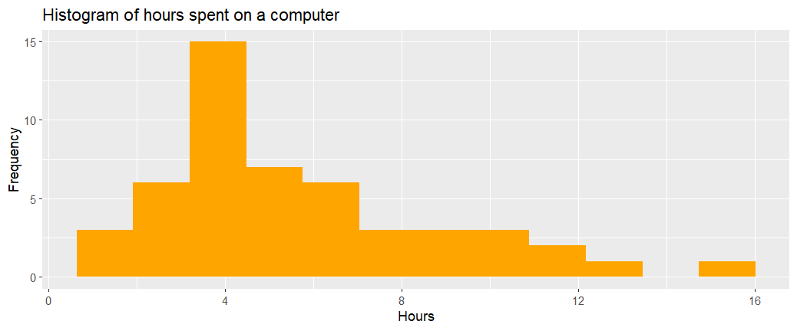
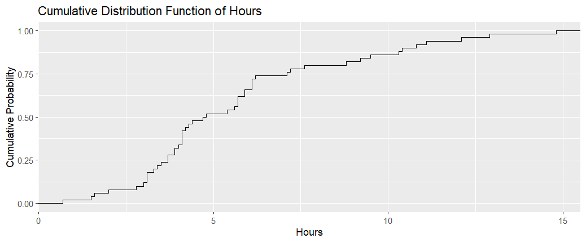
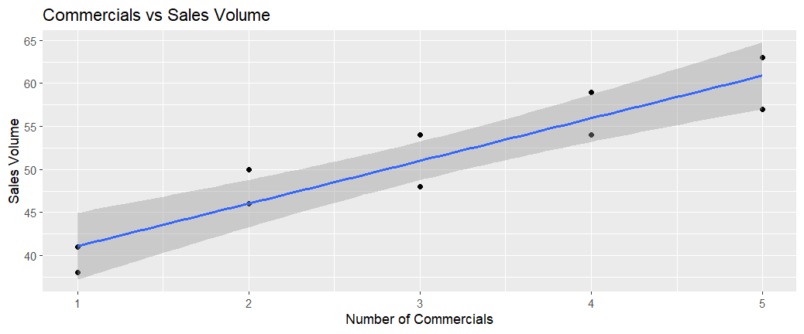
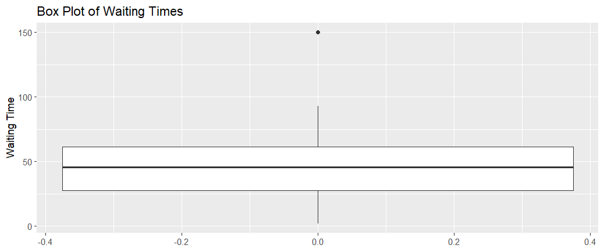
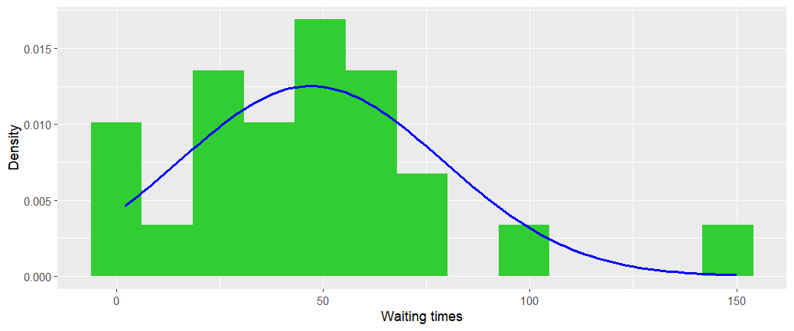
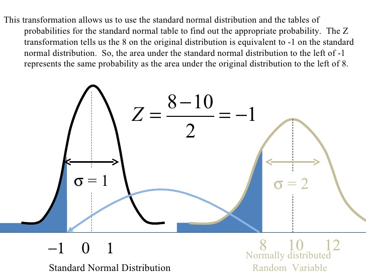
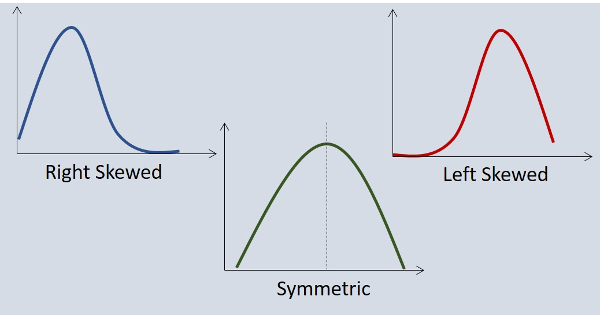

---
title: "Descriptive statistics"
format:
  html:
    toc: true
    number-sections: false
execute:
  eval: false
  echo: false
  warning: false
  error: false
---

## Graphical data presentations

Even a small set of data is often difficult to interpret straight from its values. These, so called *raw data*, are organised into tables and are displayed using plots and other graphics.

### Summarising qualitative data: frequency and relative fre   quency

For a **qualitative** data set we can construct *frequency* and *relative frequency* distributions. 

* A frequency distribution is a tabular summary of data showing the number (frequency) of items in each of several
non-overlapping classes. Often displayed using a *bar chart*. 
* A releative frequency distribution displays the frequency of each item in a class divided by the number of the elements in the whole data set. Often displayed using a *pie chart*.

With *n* observations,
$$
\text{Relative frequency of class} = \frac{\text{Frequency of class}}{n}.
$$

> #### Example: Last Names
> This example data set includes 50 individuals with one of the six most common last names in Ireland. The data file `names.txt` is on Blackboard.  

We can draw a bar chart to show the frequencies of last names within the dataset.

```{r, echo=TRUE, eval=FALSE}
# Read in data
names <- readLines("names.txt")
field_name <- "last_names"
names_df <- data.frame(name = names[-1], stringsAsFactors = FALSE)
colnames(names_df) <- field_name

#Find frequencies
frequency_df <- as.data.frame(table(names_df[[1]]))
colnames(frequency_df) <- c(field_name, "Frequency")

#Draw a bar plot with lime green coloured bars
ggplot(frequency_df, aes(x=last_names, y = Frequency)) +
  geom_bar(stat="identity", fill = "limegreen") +
  labs(
    title = "Frequency of Last Names",
    x = names[1],
    y = "Frequency"
  )
```

The relative frequency is defined in the same way as for quantitative data
and represents the proportion of the observations belonging to a specific class. 

> #### Example: Computer Usage
> This example includes data on personal computer usage by persons aged 12 and older during one week for
a sample of 50 persons in hours. The data can be found in the file computer.txt on the Blackboard site. 

A *histogram* is a graphical representation of quantitative data that shows frequency or relative frequency of data
values within classes. It is useful for understanding the shape or *skewness* of the numerical variable. We define skewness below. 

How does a histogram differ from a bar chart?
A histogram displays numerical data whereas a bar chart is typically used for categorical data.

The frequency or relative frequency of each class is shown by drawing a rectangle whose
base is determined by the class limits on the horizontal axis and whose height is the corresponding frequency or 
relative frequency.

We can draw a histogram of the computer hour data.

```{r, echo=TRUE, eval=FALSE}
# Read in computer data
computer <- readLines("computer.txt")
computer_field_name <- "Hours"
computer_df <- data.frame(computer = computer[-1])
colnames(computer_df)<- computer_field_name
computer_df$Hours <- as.double(computer_df$Hours)

#Draw Histogram
ggplot(computer_df, aes(x=Hours)) +
  geom_histogram(
    bins=12,
    fill ="orange"
  ) +
  labs(
    title = "Histogram of hours spent on a computer",
    x = "Hours",
    y = "Frequency"
  ) 
```



### Cumulative Frequency Distribution

The *cumulative frequency distribution* shows the number of data items with values less than or equal to the upper
class limit of each class. We come back to this later in the chapter when we introduce the cumulative distribution function. 

Similarly, the *cumulative relative frequency distribution* shows the proportion of data items with values less then or equal to the upper limit of each class.

A graph of cumulative distribution is called an *ogive*. An ogive shows data values on the horizontal axis
and cumulative frequencies or cumulative relative frequency on the vertical axis.

For example, we can plot the empirical cumulative distribution function (ECDF) for the computer example.

```{r, echo=TRUE, eval=FALSE}
ggplot(computer_df, aes(x=Hours)) +
  stat_ecdf() +
  labs(
    title = "Cumulative Distribution Function of Hours",
    x="Hours",
    y= "Cumulative Probability"
  )
```




### Scatter diagram and trend line

A scatter diagram is a graphical representation of the relationship between two quantitative variables. A trend
line is a line that gives an approximation of the relationship.

As an illustration of a scatter diagram, we describe data from an equipment store below.

> #### Example: Computer Store
> The data has three columns showing the week number, the number of commercials shown and the volume of sales at the equipment store that week. It is available to download on Blackboard on store.txt.

We can draw a scatterplot to illustrate the relationship between the number of commercials and sales volume.

```{r, echo=TRUE, eval=FALSE}
#Read in equipment store data
equipment_df <- read.table(
  "store.txt",
  header = TRUE,
  sep = "\t"
)

ggplot(equipment_df, aes(x=`No..of.Commercials`, y=`Sales.Volume`)) +
  geom_point()  +
  geom_smooth(method = "lm", se = TRUE) +
  labs(
    title = "Commercials vs Sales Volume",
    x = "Number of Commercials",
    y = "Sales Volume"
  )
```



## Numerical Descriptive Measures

Numerical descriptive measures are measures of location, dispersion, shape and association. If the measures are
calculated for sample data, they are called *sample statistics*. If the measures are calculated for population
data, they are called *population parameters*. A sample statistic is referred to as the *point estimator* of the corresponding population parameter.

In what follows, we follow the convention for statistical notation: 

* $X$ (capital $X$) denotes a variable, whose observations can be made;
* $x$ (small $x$) denotes the generic value that the variable $X$ may take. 

For example, $X$ could be the height variable of people, and $x = 185cm$ is a value of $X$ for a particular person.

### Measures of location

The *mean* or the *average value* is the most frequently used measure of central location.
The sample mean is the mean of a sample of data, $\mathbf{x} = (x_{1}, x_{2}, \ldots, x_{n})$, and is denoted by $\bar{x}$. The population mean is the mean of a population  $\mathbf{x} = (x_{1}, x_{2}, \ldots, x_{N})$ and is denoted by $\mu$. They are calculated as
$$
\bar{x} = \frac{\sum^n_{i=1}x_i}{n} \qquad \text{and}\qquad \mu = \frac{\sum^N_{i=1}x_i}{N},
$$
where $n$ is the size of the sample, $N$ the size of the population and $x_i$ is the value of the
variable $X$ on the $i$-th observation. 

The expression for the mean includes
all values of the data set and, as a result, it is sensitive to outliers.

The *median* is the value of the `middle' term when the data are arranged in increasing order. Where $n$ is an odd number, it is
the middle value and where $n$ is an even number, it is the average of the two middle values. The median is not influenced by outliers.

The *mode* is the value in a data set that occurs with the highest frequency. It can be determined for
quantitative and qualitative data. A data set can have no mode (if all values appear with equal frequency), one mode, or several modes (if two or more values appear with equal highest frequency). The modes in a multimodal data are not very helpful.

> #### Example: Trades of Lloyds Bank Group Shares
> The table below contains the last 5 trades of Lloyds Bank Group shares on the day of
September 22, 2017 (data from London Stock Exchange). 


| Time | Price | Volume | Trade value |
| :--- | :--- | :--- | :--- |
| 17:11:37 | 66.98 | 93,163 | 62,400.53 |
| 17:11:29 | 67.03 | 80,204 | 53,760.78 |
| 17:11:29 | 67.03 | 13,178 | 8,833.22 |
| 17:03:06 | 67.15 | 70,800 | 47,542.20 |
| 17:02:36 | 67.00 | 9,064 | 6,072.64 |


The **mean** of the price is
$$
 \bar{p} = \frac{66.98+67.03+67.03+67.15+67}{5} = 67.038 \approx 67.04 (2DP).
$$
For these data, $n=5$; therefore the **median** is the third highest price. The ordered list of prices is $(66.98, 67.00, 67.03, 67.03, 67.15)$ and the third value is 67.03.

The price of 67.03 appears twice and this would be the **mode**. For continuous numerical data, it may be more appropriate to find the range of values that contains the most datapoints. 

Deciding which measure to use (mean, median or mode), will depend on your dataset.

### Measures of variability

The most common measures of variability are: range, interquartile range, variance and standard deviation. The *range* is the difference between the largest and the smallest values. The range is based only on two observations and it is highly influenced by outliers.

The *interquartile range* is the range of the middle 50% of the data, and so does not depend on outliers.

The *variance* is a measure of variability that takes into account all of the data. It is based on
the difference between the value of each observation $x_i$ and the mean $\bar{x}$
$$
x_i - \bar{x},
$$
called the *deviation about the mean*. 

The population variance $\sigma^2$, for a population of size $N$ and with population mean $\mu$, is given by
$$
\sigma^2 = \frac{\sum^N_{i=1}(x_i-\mu)^2}{N-1}.
$$
The sample variance $s^2$ for a sample of size $n$ and mean $\bar{x}$ is calculated as
$$
s^2 = \frac{\sum^n_{i=1}(x_i-\bar{x})^2}{n-1}.
$$
The statistic $s^{2}$ gives an unbiased estimate for the population variance. Note that the sum of the squared deviations about the sample mean is divided by $(n - 1)$, not $n$ as one might expect.

The variance is a useful measure when comparing variability between two or more variables, samples or populations. The variable, sample or population with the largest variance will show the greatest variability.

The *standard deviation* is the positive square root of the variance. The standard deviation is measured
in the same units as the original data and consequently it is commonly used in practice.

A descriptive statistic that indicates how large is the standard deviation relative to
the mean is called 
The *coefficient of variation* measures how large the standard deviation is relative to the mean and is given by
$$
\frac{\text{Standard deviation}}{\text{mean}} \times 100\%,
$$
the ratio of the standard deviation and the mean.

A *percentile* provides information on how the ordered data are spread over the range of the data. The $p$-th percentile is a value such that at least $p$ percent of the data are less than or
equal to this value and at least $(100-p)$ percent of the data are greater than or equal to this value. 

To calculate percentiles for a sample data $x_1,x_2,...,x_n$, follow the steps below.

1. Arrange data in increasing order denoted by $x_{(1)},x_{(2)},...,x_{(n)}$ i.e. $x_{(1)} \leq x_{(2)} \leq ... \leq x_{(n)}$.
2. Calculate $i = (\frac{p}{100})n$ where $p$ is the percentile of interest and $n$ the size of the sample.
3. If $i$ is not an integer, round up and the resulting value of $i$ gives the position of the $p$-th percentile. If $i$ is an integer, the $p$-th percentile is the average of the values in the positions $i$ and $i + 1$.

> #### Example: Waiting Time
> The waiting time data is a list of 24 values, which describe the time spent waiting for a service. They can be found in the file WaitingTime.txt.

(a) Compute	the $30$-th percentile.
We note that $n=24$ and $p = 30$. First, we compute the location
$$
 i = \left(  \frac{p}{100} \right) \times n = \frac{30}{100} \times 24 = 7.2.
$$
Hence, the $30$-th percentile is
$$
 x_{(\lceil i \rceil)} = x_{(\lceil 7.2 \rceil)} = x_{(8)} = 30,
$$
where $\lceil i \rceil$ is the smallest integer that is greater than or equal to $i$.

(b) Compute the $25$-th percentile. 
We note that $n=24$ and $p = 25$. First, we compute the location
$$
 i = \left(  \frac{p}{100} \right) \times n = \frac{25}{100} \times 24 = 6.
$$
Hence, the $25$-th percentile is
$$
 Q_1 = \frac{x_{(i)} + x_{(i+1)}}{2} = \frac{x_{(6)} + x_{(7)}}{2} = \frac{26+28}{2} = 27.
$$
		
(c) Compute the $75$-th percentile. 
We note that $n=24$ and $p = 75$. First, we compute the location
$$
 i = \left(  \frac{p}{100} \right) \times n = \frac{75}{100} \times 24 = 18.
$$
Hence, the $75$-th percentile is
$$
 Q_3 = \frac{x_{(i)} + x_{(i+1)}}{2} = \frac{x_{(18)} + x_{(19)}}{2} = \frac{61+62}{2} = 61.5.
$$


The *quartiles* $Q_1$, $Q_2$ and Q3 divide an ordered set of data into four equal parts. The first quartile
$Q_1$ is the same as 25th percentile, i.e. 25\% of the data set are equal to or smaller then $Q_1$. The second
quartile $Q_2$ is equal to the median and the third quartile $Q_3$ is equal to the 75-th percentile. The difference
$(Q_3 - Q_1)$ is called the interquartile range (IQR); IQR = $Q_3 - Q_1$.

The steps to calculate the quartiles are as follows:

1. Arrange the observations in non-decreasing order and locate the median $M$.
2. The first quartile $Q_1$ is the median of the observations whose positions in the ordered list is to the left of the location of $M$.		
3. The third quartiles $Q_3$ is the median of the observation whose position in the ordered list is to the right of the location of $M_1$.
	
### The five-number summary and boxplots

The five number summary of a set of observations consists of the smallest observation, the first quartile, the median, the third quartile, and the largest observation:
$$
 \text{Minimum}, \quad Q_1, \quad M, \quad Q_3, \quad \text{Maximum}.
$$

These five numbers are well represented in a *boxplot*, which consists of the following:

* A central box spans the quartiles $Q_1$ and $Q_3$	
* A line in the box marks the median $M$	
* Lines extend from the box out to the lower limits and upper limits.	
* $1.5\times \text{IQR}$ rule to determine the lower and the upper limits as follows:
$$
\begin{aligned}
\text{lower limit} &= M - 1.5 \times \text{IQR} \\
\text{upper limit} &= M + 1.5 \times \text{IQR}
\end{aligned}
$$
* All other observations beyond the lower and upper limits are marked as whiskers in the box plot. They are suspected outliers.

We consider the waiting time example. We have calculated 
$$
 Q_1 = 27, \quad  M = 45.5, \quad Q_3 = 61.5.
$$
Hence, the Inter-Quartile Range (IQR) is
$$
  \text{IQR} = Q_3 - Q_1 = 61.5 - 27 = 34.5.
$$
The lower limit is
$$
  L = M - 1.5  \times \text{IQR} = 45.5 - 1.5 \times 34.5 = -6.25
$$
and the upper limit is
$$
 U = M + 1.5  \times \text{IQR} = 45.5 + 1.5 \times 34.5 = 117.15.
$$

	

### Probability density functions and the normal distribution

A probability density function $f(x)$ or PDF (to be defined later) provides a more complete description of how the data are distributed.

For example, we might fit a distribution to the waiting time data in the example above.

```{r, echo=TRUE, eval=FALSE}
ggplot(waiting_df, aes(x = Waiting.Time)) +
  geom_histogram(
    aes(y = after_stat(density)),
    bins = 13,
    fill = "limegreen",
  ) +
  stat_function(
    fun = dnorm,
    args = list(
      mean = mean(waiting_df$Waiting.Time),
      sd = sd(waiting_df$Waiting.Time)
    ),
    colour = "blue",
    linewidth = 1
  ) +
  labs(
    x = "Waiting times",
    y = "Density"
  )
```




The curve we used is completely determined by the sample mean ($\bar{x} = 47.04$) and the standard deviation ($s = 31.87$) of the data. Mathematically, the density function takes the sample mean as its true mean $\mu$ and the sample standard deviation as its true standard deviation $\sigma$ to determine the curve, which has the mathematical representation
$$
  f(x) = \frac{1}{ \sqrt{2 \pi \sigma^{2}}} e^{-  \frac{(x - \mu)^2}{2\sigma^2}  }.
$$ 
This is a normal (or Gaussian) distribution and is often denoted by $N(\mu, \sigma)$. The location and shape of this curve is completely determined by the two quantities $(\mu, \sigma)$. The density function of the normal distribution is symmetric around point $\mu$.

This function is described as a density function because of the following two properties: (i) $f(x) \ge 0$ for all $x \in \Re$. (ii) The area underneath the curve is $1$:
$$
 \int_{-\infty}^{+\infty} \ f(x) dx = 1.
$$

Although different $(\mu, \sigma)$ generate different curves, there exists a common feature of normal distributions, widely known as the $68-95-99.7$ Rule:

* In the normal distribution with mean $\mu$ and standard deviation $\sigma$:
* Approximately $68\%$ of the observations fall within $\sigma$ of the mean $\mu$.
* Approximately $95\%$ of the observations fall within $2\sigma$ of the mean $\mu$.
* Approximately $99.7\%$ of the observations fall within $3\sigma$ of the mean $\mu$.

#### Standard Normal
If we introduce a new variable $Z$ such that
$$
  Z = \frac{X - \mu}{\sigma},
$$
then we have 
$$
  X = \sigma Z + \mu.
$$
It follows from the property that the probability density function $f(x)$ integrates to 1 over the range $[-\infty, \infty]$ that
$$ 
\begin{align}
	1 &=& \int_{-\infty}^{+\infty} \ f(x) dx \\ 
	  &=& \int_{-\infty}^{+\infty} \frac{1}{\sigma \sqrt{2 \pi}} e^{-\frac 12 \left(  \frac{x - \mu}{\sigma} \right)^2 } dx \\ 
	  &=& \int_{-\infty}^{+\infty} \frac{1}{\sigma \sqrt{2 \pi}} e^{-\frac 12 z^2 } (\sigma) dz \\ 
	  &=& \int_{-\infty}^{+\infty} \frac{1}{\sqrt{2 \pi}} e^{-\frac 12 z^2 } dz.
\end{align} 
$$
The function
$$
  \phi(z) = \frac{1}{\sqrt{2 \pi}} e^{-\frac 12 z^2 }
$$
is a new density function that equates to a normal distribution with mean $0$ and standard deviation $\sigma = 1$. Its distribution is denoted as $N(0, 1)$ and it is known as the *standard normal distribution*.

### Cumulative distribution function (CDF)

Let $X$ follow a distribution with probability density function (pdf) $f(x)$. The cumulative distribution at a given value $x$ is defined as follows:
$$
 F(x) = \int_{-\infty}^x \ f(t) dt.
$$

The CDF of the standard normal distribution is frequently used to estimate confidence intervals on estimates. We will see later why this is the case. For now, we show how this can be used.

Let $Z$ have the standard normal distribution $N(0, 1)$ with $\phi(z)$ as given immediately below being its density function. The cumulative distribution at a given value $z$ is defined as follows:
$$
 \Phi(z) = \int_{-\infty}^z \ \phi(t) dt.
$$
It follows from the $Z$ transformation that
$$
 F(x) = \Phi \left(   \frac{x-\mu}{\sigma} \right).
$$ 
This implies that the cumulative distribution of $F(x)$ can be obtained through that of $\Phi(z)$ with $z= (x-\mu)/\sigma$. Tables listing the values of $\Phi(z)$ are widely available and can be used to obtain the $z$ value from $x$.



### Skewness

As seen above, the normal distribution has a symmetric shape. But there are many nonsymmetric shapes. For example, a shape may be skewed to the left or right.
The measure of skewness is defined as follows:
$$
  \texttt{skewness} = \frac{n}{(n - 1)(n - 2)} \sum^n_{i=1}\left(\frac{x_i - \bar{x}}{s}\right)^3
$$
The skewness can be easily calculated using statistical software.

The following figure displays the skewness graphically.

* A distribution is said to be skewed to the left, or negatively
skewed, if its tail extends further to the left.  
* A distribution is right skewed if its tail extends further to the right.
* A distribution is symmetrical if there is no obvious skewness.



### Z-Scores
The *z-scores* give the relative location of data items within a data set. In a sample of $n$ observations
$x_1,x_2,...,x_n$, the z-score $z_i$, for observation $x_i$ is calculated as
$$
z_i = \frac{x_i-\bar{x}}{s}, \qquad i = 1,2,...,n
$$
where $\bar{x}$ is the sample mean and $s$ the sample standard deviation.
We observe the similarity between the z-score and the $Z$ transformation. 
The z-score is often called the
standardized value and can be interpreted as the number of standard deviations $x_i$ is from
the mean $\bar{x}$. For example, $z_1$ = 1.7 would indicate that $x_1$ is 1.7 standard deviations greater than
the mean and $z_1 = -0.5$ would indicate that $x_1$ is $0.5$ standard deviations smaller than the mean.

Extreme values (unusually large or unusually small values) of a data set are called *outliers*.
Identification and review of outliers is important. Typically, any data value with
a z-score less than $-3$ or greater than $+3$ is treated as an outlier.\\

## Measures of Association

We are often interested in the relationship between two or more variables. For example, if we go back to the equipment store example which we drew a scatter plot for previously, this suggests a positive relationship between the number of commercials shown and the volume of sales. The plot also suggests that a straight line could be used as an approximation of the relationship. A positive relationship means that if the number of commercials increases, the number of sales also increases. A negative relationship would suggest that if the number of commercials increases, the number of sales decreases. 

The *covariance* is a measure of the linear relationship between two variables. For a sample of size $n$ with 
observations ($x_1,y_1$), ($x_2,y_2$),...,($x_n,y_n$), the sample covariance $x_{xy}$ is defined as
$$
s_{xy} = \frac{\sum^n_{i=1}(x_i-\bar{x})(y_i-\bar{y})}{n-1},
$$
and the covariance of a population of size $N$ is given using slightly different notation, as
$$
\sigma_{xy} = \frac{\sum^N_{i=1}(x_i-\mu_x)(y_i-\mu_y)}{N-1}.
$$

> **Exercise:** Calculate the covariance $s_{xy}$ for the previous example. (Answer: 11)

One of the problems with using the covariance as a measure of the strength of the linear relationship is that the
value of the covariance depends on the units of measurements for the variables. We need a measure that is
independent of the measurement units.

The **correlation coefficient**, $r_{xy}$, is a measure of the linear relationship between two variables $x$ and $y$ that is not affected by the units of measurement. The correlation coefficient is defined as
$$
r_{xy} = \frac{s_{xy}}{s_xs_y}
$$
where $s_{xy}$ is the sample covariance, $s_x$ is the sample standard deviation of x and $s_y$
is the sample standard deviation of $y$. 

> **Exercise**: Calculate the sample correlation coefficient for the example above. Does this help with determining the strength of the relationship? (Answer: 0.93)

As usual, somewhat different notation is used if the correlation coefficient is calculated
from population data:
$$
\rho_{xy} = \frac{\sigma_{xy}}{\sigma_x\sigma_y},
$$
where $\rho_{xy}$ is the population correlation coefficient, $\sigma_{xy}$ is the population covariance,
$\sigma_x$ the population standard deviation for $x$ and $\sigma_y$ the population standard deviation for
$y$. The correlation has a limited range, $-1 \leq \rho_{xy} \leq 1$, where $1$ indicates perfect positive linear
relation, $-1$ perfect negative relation and $\rho_{xy}$ = 0 indicates that there is no relation
between $x$ and $y$.

> **Exercise:** Let $X$ and $Y$ be random variables with finite means and variances. Using the expression for $\rho_{xy}$ above, show that $Y = a + bX$ if and only if $\rho = \pm1$.

### The weighted mean and grouped data mean
The weighted sample mean is a mean that can attach more importance (weight) to some observations than to
others. It is calculated as
$$
\bar{x} = \frac{\sum^n_{i=1}w_ix_i}{\sum^n_{i=1}w_i},
$$
where $x_i$ is the values of observation i and $w_i$ is the weight for the observation i.

If data are grouped into k classes (also called groups or bins) with mid values $M_1,M_2,...,M_k$
and corresponding class frequencies $f_1,f_2,...,f_k$, the mean is given as
$$
\bar{x} = \frac{\sum^k_{i=1}f_iM_i}{n}
$$
and the sample variance for grouped data is
$$
s^2 = \frac{\sum^k_{i=1}f_i(M_i-\bar{x})^2}{n-1},
$$
where $f_1 + f_2 +... +f_k = n$.

