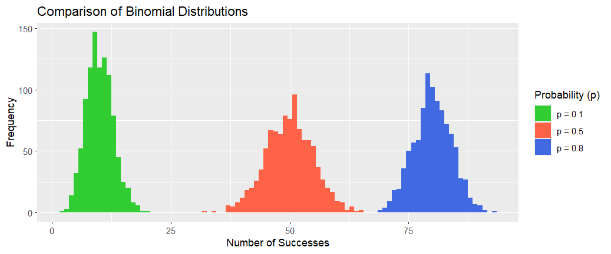
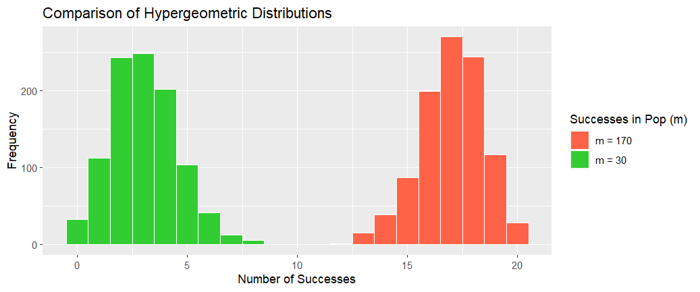
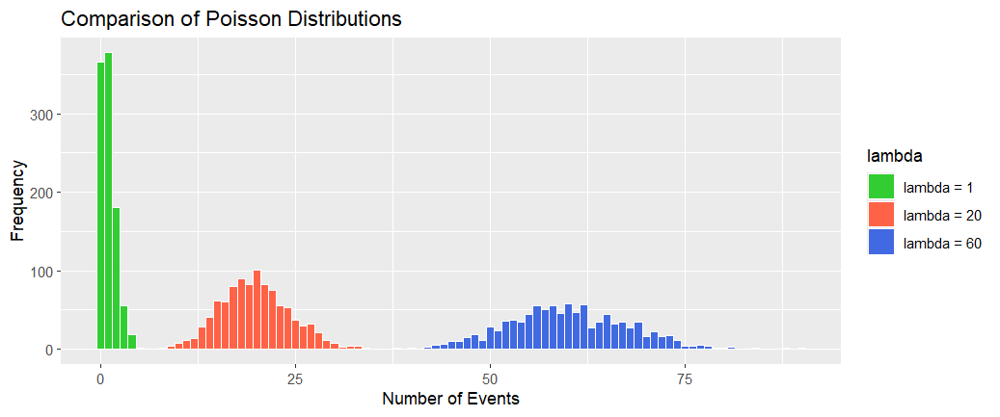

The previous chapter focuses on the summary statistics (descriptive statistics), which can be regarded as a preliminary stage of data analysis.
In fact, we can go much deeper by fitting the data to *parametric distributions*. This chapter and the next focus on the fitting process.
We begin with a brief introduction to two important concepts when fitting distributions: random variables and probability.

## Random variables and Probability

In general, we describe a phenomenon as being *random* if individual outcomes are uncertain but there is
a regular distribution of outcomes in a large number of repetitions.
The *probability* of any outcome of a random phenomenon is the *proportion* of times that the outcome would occur in a very large number of repetitions.

In reality, we often encounter the unpredictable side of randomness, but we rarely
see enough repetitions of the same random phenomenon to observe the long-term regularity that
probability describes.

We use the widely used example of tossing a coin to illustrate randomness and probability.

> ### Example: Tossing a Coin

If we toss a coin, there are only two possible outcomes:
$$
S = \left\{  \texttt{H}, \ \texttt{T}   \right\},
$$

where *H* represents a Head being uppermost and *T* a Tail being uppermost.
If we toss the coin twice, the possible outcomes are
$$
   S = \left\{  \texttt{HH}, \ \texttt{HT},  \ \texttt{TH}, \ \texttt{TT}   \right\}.
$$
If we toss the coin three times, the possible outcomes are
$$
S = \left\{  \texttt{HHH},\  \texttt{HHT},  \ \texttt{HTH}, \ \texttt{THH}, \ \texttt{THT}, \ \texttt{TTH}, \ \texttt{HTT}, \ \texttt{TTT}   \right\}.
$$
If we toss the coin four times, the possible outcomes are

$$
S = \left\{ \begin{array}{l} \texttt{HHHH},\  \texttt{HHHT},  \ \texttt{HHTH}, \ \texttt{HHTT}, \ \texttt{HTHH}, \ \texttt{HTHT}, \ \texttt{HTTH}, \ \texttt{HTTT} \\
\texttt{THHH},\  \texttt{THHT},  \ \texttt{THTH}, \ \texttt{THTT}, \ \texttt{TTHH}, \ \texttt{TTHT}, \ \texttt{TTTH}, \ \texttt{TTTT}
 \end{array}   \right\}.
$$

What can we say about this example?

(i) If we toss a coin, the outcome is unpredictable. It might be Head or Tail. This is the first element in randomness.

(ii) If we toss a coin many times and if the coin is balanced, the number of Heads appearing should be roughly equal to the number of Tails appearing. In other words, the *probability* of H appearing after many times of tossing is about $1/2$. This is the *regularity*. The unpredictable outcome for each toss and the regularity of there being a probability of $1/2$ of H being uppermost make the coin toss a random event.
The famous statistician Karl Pearson once tossed a coin $24000$ times, recording $12012$ times of $H$ appearing, a proportion of $0.5005$, which is very close to $1/2$.

(iii) $S$ above is called the *sample space*. For example, $S$ for the problem of throwing four coins is
the sample space after $4$ tosses. Any element in $S$ is called an event, e.g. *HHHT* is one outcome and is an event. More generally, any subset of $S$ is called an event. For example,
$$
S_1 = \left\{
\texttt{HHHT},\  \texttt{HHTH},  \ \texttt{HTHH}, \ \texttt{THHH}
\right\}
$$
is an event that H appeared three times (e.g., the event of ''exactly three heads'').

A description of a random phenomenon in the language of mathematics
is referred to as a *probability model*. The study of probability models may be cast as a two-stage learning process. The first stage is to study
the probability model and derive its mathematical characteristics.
The second stage is to apply those characteristics to real data and to estimate the probability and
its consequences for the real system.

## Discrete Probability Models

> ### Discrete probability model

A *discrete random variable* $X$ with values $x_0,x_1,x_2,...$ is described by its probability distribution function $p(k)$,
$$
p(k) = P\{X = x_k\}, \qquad k = 0,1,2,3,...
$$
where $0 \leq p(k) \leq 1$, $\sum^{\infty}_{k=0} p(k)=1$. In this discrete probability model,
the sample space and the probabilities are

\begin{align}
 S & =  \left\{ 
   x_1, \ x_2, \ x_3, \ldots
 \right\} \\
 P & =  \left\{
  p_1, \ p_2, \ p_3 , \ldots
 \right\},
\end{align}

where $p_k = P(X = x_k)$. The sample space can be finite or countably infinite (i.e., its elements have a one-to-one mapping with the set of natural numbers).

> **Exercise:** Describe the probabilities for the coin example.

It is important to distinguish between a random variable and the possible values that it can take.
Standard notation is to use capital letter, such as $X$, to denote the random variable; and
to use the corresponding lowercase letter, $x$, to denote a possible value, as introduced previously in Chapter 3.\\

For a discrete random variable, the *cumulative distribution function* $F(x)$ of $X$ is defined as
$$
F(x) = P \{X \leq x\} = \sum_{\{k|x_k \leq x\}} P\{X = x_k\} = \sum_{\{k|x_k \leq x\}} p(k).
$$

## Conditional Probability, Independent and Dependent Events

If A and B are two events, the probability that B happens given that A has happened is denoted
as
$$
   P(B | A) = \frac{P( A \cap B)} {P(A)}.
$$
If the occurrence or non-occurrence of A does not affect the probability of occurrence of B,
then
$$
 P(B | A) = P(B),
$$
and we say that A and B are independent events. Otherwise they are dependent.
If A and B are independent, then
$$
  P(A \cap B) = P(A) \times P(B).
$$

> ### Example: Independence
> Suppose that a bag contains $4$ white balls and $2$ black balls. Let *A* be the event *first ball drawn is white* and *B* be the event *second ball drawn is white*, where the balls are not replaced after being drawn. Here, *A* and *B* are dependent events.

The probability that *A* happens is
$$
P(A) = \frac{4}{4+2} = \frac 23.
$$
The probability that *B* happens given that *A* has happened is
$$
 P(B | A) = \frac{3}{3+2} = \frac 35.
$$
Thus the probability that both balls drawn are white is
$$
 P(A \cap B) = P(A) \times P(B | A) = \frac 23 \times \frac 35 = \frac 25.
$$

## Characteristics: Expectation and Variance

The *expectation* or the *expected value* of a discrete random variable $X$ with possible
values $x_0,x_1,x_2,....$ is defined by
$$
   \mu_X = \textbf{E}[X]=\sum^{\infty}_{k=0}x_kP\{X = x_k\}.
$$
The expectation is also called the *mean* of a random variable $X$ and it is denoted by
$E[X]$, $\mu_x$ or $\mu$. Note that the sum $\sum^{\infty}_{k=0}x_kP\{X = x_k\}$ represents the weighted
average of $X$ where each value $x_k$ of $X$ is weighted by $p(k) = P\{X = x_k\}$.

The variance of a random variable $X$ with possible values $x_0,x_1,x_2,....$ is defined by
$$
   \sigma_X^2 = Var(X) = \textbf{E}(X-\textbf{E}[X])^2.
$$
By expanding the right hand side we get
$$
  Var(X) = \textbf{E}[X^2] - (\textbf{E}[X])^2.
$$
an expression that is more convenient for calculations.

Assuming that $X$ is a discrete random variable and $g(\cdot)$ a function, $g(X)$ is a random variable and
$$
\textbf{E}[g(X)]=\sum^{\infty}_{k=0}g(x_k)P\{X = x_k\}.
$$

For example, where $g(x) = (x - E[X])^2$, we have:

\begin{align}
E(g(X)) & = E[(X- E[X])^2] \\
& = \sum^{\infty}_{k=0}(x_k - E[X])^2 P\{X = x_k\} \\
& = \sum^{\infty}_{k=0} x_k^2 P\{X = x_k\} - (E[X])^2 \\
& = E[X^2] - (E[X])^2.
\end{align}

Hence,
$$
Var(X) = E[(X - E[X])^2]  = E[X^2]- (E[X])^2.
$$
The variance of $X$, $Var(X)$ is often denoted by $\sigma^2$ or $\sigma^2_X$.

The standard deviation $\sigma$ of $X$ is defined as the square root of the variance:
$$
\sigma = \sigma_X = \sqrt{Var(X)}
$$
It is easy to verify the following properties of the variance:

* $Var(aX + b) = a^2Var(X)$, where $a, b$ are constants;
* $Var(X + Y) = Var(X) + Var(Y)$ when $X$ and $Y$ are independent random variables.

The most commonly used discrete distributions are:

* Discrete uniform distribution
* Bernoulli distribution
* Binomial distribution
* Negative Binomial distribution
* Geometric distribution
* Hypergeometric distribution
* Poisson distribution

For each of the listed distributions we will write down its probability distribution function, give a basic
example and calculate the expectation and the variance.

## Discrete Uniform Distribution

> ### Definition
> A discrete random variable $X$ has a \textbf{uniform} distribution if it assumes each of its finitely many values $x_1,x_2,...,x_n$ with the same probability,
> $$
> \ P\{X = x_k \} = \frac{1}{n}, \qquad k = 1,2,...,n.
> \ $$

The expected value is the average of the possible values:
$$
 \mu_X = \textbf{E}(X) = \sum^n_{k=1} x_k P\{X = x_k \} = \frac{1}{n} \sum^n_{k=1} x_k = \bar{x}
$$
and the variance is
$$
 \sigma_X^2 = E[(X - \mu_X)^2] = \sum_{k=1}^n x_k^2 p_k - \mu_X^2 = \frac 1n \sum_{k=1}^n x_k^2 - \bar{x}^2.
$$

> ### Tossing a Fair Die
> $$
> P\{X = x_k \} = \frac{1}{6}, \qquad k = 1,2,...,6.
> $$
> Its expectation is
> $$
>  \mu_X = \frac 1n \sum_{k=1}^6 k = \frac{1+2+3+4+5+6}{6} = 3.5.
> $$
> Note that the expectation is NOT one of the outcomes in $x_k$.

## Bernoulli random variable

> ### Definition
> A \textbf{Bernoulli} random variable $X$ is a random variable with two outcomes,
> $X \in \{0,1\}$, and
> $$
>     P \{X = 1\} = p,\quad  P \{X = 0\} = q = 1 - p.
> $$

It is easy to calculate that the mean is
$$
  \mu_X = E(X) = \sum_x x P(x) = 0 \times (1-p) + 1 \times p = p
$$
and the variance is

\begin{align}
  \sigma_X^2 & =   E[(X - \mu_X)^2]  \\
  & =  \sum_x x^2 P(x) - \mu_X^2 = 0^2 \times (1-p) + 1^2 \times p  \\
   - p^2 \\
 & =   p(1-p) = pq.
\end{align}


This random variable, named after the Swiss mathematician James Bernoulli (1655--1705), is one of the simplest types of random variables. The value of a coin toss is an example of a Bernoulli random variable.

The Bernoulli model is a building block for the Binomial model, discussed below.

## Binomial random variable

Binomial random variables are among the most widely used discrete random variables.

> ### Definition
> A random variable $X$ is a \textbf{binomial} random variable with parameters $n$
> and $p,\; 0 < p < 1$, if
> $$
> P\{X = k\} = \begin{pmatrix} n \\ k \end{pmatrix} p^k (1 - p)^{n-k}, \qquad k = 0,1,2,...,n
> $$

If $X$ is a binomial random variable, we write $X \sim$ bin(n,p).

Recall the binomial theorem:

$$
(a + b)^n  = \sum^n_{k=0}\begin{pmatrix} n \\ k \end{pmatrix} a^kb^{n-k}
\qquad \text{with} \ \ \begin{pmatrix} n \\ k \end{pmatrix} = \frac{n!}{k!(n-k)!}.
$$
Let $a=p$ and $b = 1-p$, then the binomial theorem implies
$$
\sum_{k=0}^n P\{X = k\} = (1-p+p)^n = 1^n = 1.
$$

> ### Example
> Let $X$ be the number of heads in $n$ tosses of a fair coin, where the probability of a head in each single toss is $p = 1/2$. Possible values for $X$ are $0,1, 2,3,...,n$ and the
> probability of $k$ heads is given by
> $$
> P\{X = k\} = \begin{pmatrix} n \\ k \end{pmatrix} p^k (1 - p)^{n-k} = \begin{pmatrix} n \\ k \end{pmatrix}
>          \frac{1}{2^n} , \qquad k = 0,1,2,...,n
> $$
> where $\begin{pmatrix} n \\ k \end{pmatrix}$  is the number of different arrangements of
> $k$ heads in $n$ tosses.

Following the example, the probability that an outcome will occur $k$
times in $n$ performances follows a binomial distribution with parameters $n$ and $p$. A binomial variable is thus the result of repeating the Bernoulli model $n$ times.

The expectation and the variance of a binomial random variable $X$ can be calculated
as follows.
We can think of $X$ as the sum of $n$ independent Bernoulli variables,
$X_1,X_2,...,X_n$,
$$
X = \sum^n_{i=1} X_i
$$
and using this we get
$$
\textbf{E}(X) = \textbf{E}\left(\sum^n_{i=1}Xi\right) = \sum^n_{i=1} \textbf{E}(X_i) = np.
$$
Similarly, for the variance we have:
$$
Var(X) = Var\left(\sum^n_{i=1}X_i\right) = \sum^n_{i=1}Var(X_i) = npq.
$$
Note that for $Var\left(\sum^n_{i=1}X_i\right) = \sum^n_{i=1}Var(X_i)$ we need to assume that the $X_i$ are independent.

```{r, echo=TRUE, eval=FALSE}
# Sample data
n_trials <- 100
sample_size <- 1000
sim_data_1 <- rbinom(n=sample_size, size = n_trials, prob = 0.1)
sim_data_2 <- rbinom(n=sample_size, size = n_trials, prob = 0.5)
sim_data_3 <- rbinom(n=sample_size, size = n_trials, prob = 0.8)
sim_df <- data.frame(successes = c(sim_data_1, sim_data_2, sim_data_3),
                     distribution = rep(c("p = 0.1", "p = 0.5", "p = 0.8"),
                                        each = sample_size))

# Plot the data on a histogram
ggplot(sim_df, aes(x=successes, fill = distribution)) +
  geom_histogram(binwidth = 1,
                 center = 0) +
  scale_fill_manual(values = c("p = 0.1" = "limegreen", "p = 0.5" = "tomato", "p = 0.8" = "royalblue")) +
  labs(title = "Comparison of Binomial Distributions",
       x = "Number of Successes",
       y = "Frequency",
       fill = "Probability (p)")
```



> **Example areas of application:**

1. Quality control measures and sampling schemes.
2. Industry. In processes having two possible outcomes (Failure, Success) with constant probability of success.
3. Medicine (cure, no cure).
4. Military (the result of firing a missile (hit, miss)).

## Hypergeometric random variable

We first use an example to illustrate the situation where the hypergeometric distribution is needed.

> ### Example: Replacement
> Suppose we have a bag of $15$ balls, of which $9$ are white and $6$ are black. The probability $p$ of drawing a white ball and the probability $q$ of drawing a black ball are:
> $$
> p = \frac{9}{15} , \qquad q = \frac{6}{15}.
> $$
> We make the following draws. We randomly draw a ball from the bag and then put it back so that the bag still has $15$ balls. We then repeat this draw five times. What is the probability of having $3$ white balls in the $5$ draws? This process is known as an *experiment with replacement*.

We note that for each draw, the probability of drawing a white ball, $p$, does not change. The process can be modelled by the Binomial model. Let $X$ be the number of white balls in the $5$ draws. Then
$$
 P(X=3) = \begin{pmatrix} n \\ k \end{pmatrix} p^k q^{n-k}, \qquad \text{with} \ n=5,\ k=3.
$$

Now we consider a slightly different drawing process.

> ### Example: No Replacement
> The only difference from the previous experiment is that each time we draw a ball, we do not return it to the bag. Hence, the probability of drawing a white ball each time changes, depending on the previous draws. What is the probability of having $3$ white balls in the $5$ draws? Such a process is often referred to as an *experiment without replacement*.

The correct answer is given by the hypergeometris distribution:
$$
  P(X=3) = \frac{\begin{pmatrix} 9 \\ 3 \end{pmatrix} \begin{pmatrix} 6 \\ 2 \end{pmatrix}}
  {\begin{pmatrix} 15 \\ 5 \end{pmatrix}} = 0.420 (3dp)
$$

For a variable to follow a hypergeometric distribution, the following conditions are met.

1. A random sample of size $n$ is selected without replacement from a population of $N$ items (population size is $N$).

2. In the population $k$ of the $N$ items can be classified as successes, and $N - k$ items can be classified as failures ($k$ items being of ``success'').

3. The size of random sample $n$ does not exceed the number of successes $k$ or the number of failures $N - k$, that is $n \leq \min\{k, N-k\}$ (sample size is $n$).

A random variable $X$ that represents the number of successes in an
experiment with the above characteristics is called a *hypergeometric* random variable.

> ### Definition
> A random variable $X$ is said to have the \textbf{hypergeometric distribution}
> with parameters $N, n \ \text{and} \ k$ if
> $$
> P(X = m) = \frac{\begin{pmatrix} k \\ m \end{pmatrix}\begin{pmatrix} N-k \\ n-m \end{pmatrix}}
>             {\begin{pmatrix} N \\ n \end{pmatrix}}, \ m=0,1,2,...,n, \ n \leq \min\{k,N-k\}.
> $$
> We write $X \sim h(N, k, n)$ and we say that $X$ is a hypergeometric random variable.

Think of $X$ as the \textbf{number of successes} in a random sample of size $n$ selected from a
population of size $N$ with $k$ successes and $N - k$ failures.

> **Exercise** Verify that
> $$
> P(X = m) = \frac{\begin{pmatrix} k \\ m \end{pmatrix}\begin{pmatrix} N-k \\ n-m \end{pmatrix}}
>             {\begin{pmatrix} N \\ n \end{pmatrix}}, \ m=0,1,2,...,n.
> $$
> is a probability distribution function. That is, show that
> $$
> \frac{\sum^n_{m=0}\begin{pmatrix} k \\ m \end{pmatrix}\begin{pmatrix} N-k \\ n-m \end{pmatrix}}
>             {\begin{pmatrix} N \\ n \end{pmatrix}} = 1,
> $$
> which is equivalent to
> $$
> \sum^n_{m=0}\begin{pmatrix} k \\ m \end{pmatrix}\begin{pmatrix} N-k \\ n-m \end{pmatrix} =
>         {\begin{pmatrix} N \\ n \end{pmatrix}}.
> $$
> The *expectation* and the *variance* of $X, X \sim h(N, k, n)$ are given by
> $$
> E(X) = \frac{nk}{N}, \ Var(X) = \frac{(N-n)nk}{N(N-1)} \left( 1-\frac{k}{N} \right).
> $$

```{r, echo=TRUE, eval=FALSE}
# Sample hypergeometric data
N_pop <- 200
n_sample <- 20
sample_size <- 1000
hg_sim_data_1 <- rhyper(nn = sample_size, m = 30, n = N_pop - 30, k = n_sample)
hg_sim_data_2 <- rhyper(nn = sample_size, m = 170, n = N_pop - 170, k = n_sample)

sim_df <- data.frame(successes = c(hg_sim_data_1, hg_sim_data_2),
                     distribution = rep(c("m = 30", "m = 170"),
                                        each = sample_size))

# Plot the data on a histogram
ggplot(sim_df, aes(x=successes, fill = distribution)) +
  geom_histogram(binwidth = 1,
                 center = 0,
                 color = "white") +
  scale_fill_manual(values = c("m = 30" = "limegreen", "m = 170" = "tomato")) +
  labs(title = "Comparison of Hypergeometric Distributions",
       x = "Number of Successes",
       y = "Frequency",
       fill = "Successes in Pop (m)")
```



The \textbf{applications} of hypergeometric distributions are similar to those of the binomial
distribution but the probabilities of successive outcomes in a series of trials are no longer independent because a sample is drawn from a finite population without replacement.

For example, the probability of getting 3 red cards in 5 draws from a deck of 52 ordinary playing
cards follows a  binomial distribution if each card is replaced and the deck reshuffled before
the next draw is made. It follows a hypergeometric distribution if the drawn cards are not returned to the pack.

> **Exercise:** Find the probabilities of drawing three red cards from a deck of 52 ordinary playing cards for the two cases of (i) the cards being replaced after each draw; and (ii) the cards not being returned to the pack.

If $X$ represents the number of red cards in $5$ draws with replacement then $X \sim bin(5, 0.5)$.
$$
P(X = 3) = \begin{pmatrix} 5 \\ 3 \end{pmatrix} p^3(1-p)^2 = \begin{pmatrix} 5 \\ 3 \end{pmatrix} \left(\frac{1}{2} \right)^3
    \left( 1-\frac{1}{2} \right)^2 = \frac{5}{8} = 0.625
$$
If the cards are drawn without replacement then $X \sim h(52, 26, 5)$ and the probability
of selecting 3 red cards (3 red and 2 black) in 5 draws is given with
$$
P(X = 3) = \frac{\begin{pmatrix} 26 \\ 3 \end{pmatrix}\begin{pmatrix} 26 \\ 2 \end{pmatrix}}{
\begin{pmatrix} 52 \\ 5 \end{pmatrix} } = 0.32513.
$$

The hypergeometric distribution is often used for *acceptance sampling*, where a sample of products are sampled in order to determine whether or not the entire set of products reaches an acceptable standard, e.g. on a production line.

> ### Example: Acceptance sampling
> A company groups components into sets of 40 and a set is considered to be defective if 3 or more components are defective. The set of components is tested by drawing a sample of 5 components at random. What is the probability that exactly one defective component is found in the sample, if there are 3 defective components in the entire set of 40?

**Solution:** If $X$ represents the number of defective components in the sample of size
$n = 5$, then $X \sim$ (40, 3, 5) and the asked probability is
$$
P(X = 1) = \frac{\begin{pmatrix} 3 \\ 1 \end{pmatrix}\begin{pmatrix} 37 \\ 4 \end{pmatrix}} {\begin{pmatrix} 40 \\ 5 \end{pmatrix} } = 0.3011.
$$

## Geometric random variable

> ### Definition
> A random variable $X$ has a \textbf{geometric} distribution with the parameter
> $p, 0 < p < 1$ if
> $$
> P(X = k) = (1-p)^{k-1}p,\ \ k = 1,2,3...
> $$

We write $X \sim Geom(p)$.

> ### Example: first son
> A family keeps having children until they get the first son. Assuming the probability of
> getting a son is 0.5, determine the probability that the family will have at least 3 children.

Note that $\sum^{\infty}_{k=1}(1-p)^{k-1}$ is a sum of a geometric series with the common quotient 1 - p and hence
$$
\sum^{\infty}_{k=1}P(X=k) = \sum^{\infty}_{k=1}(1-p)^{k-1}p = p\sum^{\infty}_{k=1}(1-p)^{k-1}=p\frac{1}{1-(1-p)}=1
$$

**Exercise:** Show that
$$
E[X] = \frac{1}{p}, \qquad Var(X)=\frac{1-p}{p^2}.
$$
Think of $X$ as a number of trials needed to produce the first success where $p$ is the
probability of a success in each single trial.

> ### Memoryless Property of the Geometric Distribution
> The memoryless property states that if an event has not occurred by time $a$, the probability that it will not
> occur after additional time $b$ is the same as the probability that it will not occur in time $b$.
> It is independent of the fact that no events occurred during the first time period $a$.
> $$
> P(X > a+b|X>a) = P(X>b)
> $$

The geometric distribution is the only discrete distribution with the memoryless property.

> **Exercise:** Prove the memoryless property of the geometric distribution.

## Negative Binomial random variable

Negative binomial random variables are generalizations of geometric random variables.

> ### Definition
> A random variable $X$ has a \textbf{negative binomial} distribution with the
> parameters $r$ and $p, 0 < p < 1$, if
> $$
> P(X=k)= \begin{pmatrix} k-1 \\ r-1 \end{pmatrix} p^r(1-p)^{k-r},\qquad k =r,r+1,...
> $$

We write $X \sim$ NegBin($r, p$) or $X \sim$ NB($r, p$). Think of $X$ as a number of trials needed to produce $r$
successes where $p$ is the probability of a success in a single trial.

The binomial coefficient $\begin{pmatrix} k-1 \\ r-1 \end{pmatrix}$ gives the number of different arrangements of $(r - 1)$ successes in $(k - 1)$ trials.

> ### Example
> A couple wishes to keep having children until they have two daughters. The
> probability of a girl is $p$ and the probability of a boy is $1-p$. Let $X$ be the total number
> of children they have. The probability distribution for $X$ is given by:
> $$
> P(X=k)=(k-1)p^2(1-p)^{k-2},\qquad k=2,3...
> $$

The *expectation* and the *variance* of $X \sim$ NegBin($r, p$) are
$$
EX = \frac{r}{p}, \qquad VarX = \frac{r(1-p)}{p^2}.
$$
Note that if $X \sim$ NegBin($r, p$) then X = $\sum^r_i X_i$ where $X_i$ are independent geometric
random variables with the parameter $p$.

## Poisson random variable

The Poisson probability distribution was first proposed by Simeon Poisson (1781-1840) and has
a very large number of applications. Typically it is used to describe the number of events occurring in a fixed interval of time or space. The mathematical derivation is complicated and is hence omitted here.

Assume that an interval is divided into a very large number of equal subintervals so that
the probability of the occurrence of an event in any subinterval is very small. Moreover, we assume

* The probability of the occurrence of an event is constant for all subintervals.

* There can be no more than one occurrence in each subinterval.

* Occurrences are independent; that is, an occurrence in one interval does not influence the probability of an occurrence in another interval.

> ### Definition
> A random variable $X$ is said to have the \textbf{Poisson} distribution with parameter $\lambda$ if
> $$
> P(X=k)=\frac{e^{-\lambda}\lambda^k}{k!},\qquad k=0,1,2,3,...
> $$

We write $X \sim$ Poisson($\lambda$).

Some common applications include the number of: misprints in a book, days a university is closed due to snow during winter, arrivals into a shop, crimes in a geographical area.

**Exercise:** Note that
$$
e^{\lambda} = \sum^{\infty}_{k=0} \frac{\lambda^k}{k!}.
$$
Calculate the expectation and the variance for $X, X \sim$ Poisson($\lambda$) showing that
$$
E(X) = \lambda,\qquad Var(X) = \lambda
$$

```{r, echo=TRUE, eval=FALSE}
# Sample Poisson data
sample_size <- 1000
poisson_sim_data_1 <- rpois(n = sample_size, lambda = 1)
poisson_sim_data_2 <- rpois(n = sample_size, lambda = 20)
poisson_sim_data_3 <- rpois(n = sample_size, lambda = 60)


sim_df <- data.frame(successes = c(poisson_sim_data_1, poisson_sim_data_2, poisson_sim_data_3),
                     distribution = rep(c("lambda = 1", "lambda = 20", "lambda = 60"),
                                        each = sample_size))

# Plot the data on a histogram
ggplot(sim_df, aes(x=successes, fill = distribution)) +
  geom_histogram(binwidth = 1,
                 center = 0,
                 color = "white") +
  scale_fill_manual(values = c("lambda = 1" = "limegreen", "lambda = 20" = "tomato", "lambda = 60" = "royalblue")) +
  labs(title = "Comparison of Poisson Distributions",
       x = "Number of Events",
       y = "Frequency",
       fill = "lambda")
```



> ### Example: Printer error
> The printer on Level 4 of Building 54 has seen 5 reported failures over the last $100$ days. Answer the following questions: (a) What is the probability of no failure in a given day? (b) What is the probability of one or more failures in a given day? (c) What is the probability of at least $2$ failures in a $5$-day period?

**Solutions:** We propose to model the number of the failures (rare event) by the Poisson distribution. The expected number of failures per day is
$$
\lambda = \frac{5}{100} = 0.05.
$$

(a)  The probability of no failure in a given day is
$$
P(\text{no failure in a given day}) = P(X= 0) = \frac{e^{-0.05} \lambda^0}{0!} = 0.9512.
$$

(b) The probability of at least one failure is the complement of the probability of $0$ failure:
$$
P(X \ge 1) = 1 - P(X=0) = 1 - 0.9512 = 0.0498.
$$

(c) The average number of failures over a $5$-day period is
$$
\lambda = 0.05 \times 5 = 0.25.
$$
Hence

\begin{align*}
	 P(X \ge 2) & =   1 - P(X \le 1) = 1 - P(X=0) - P(X=1) \\
	            & =  1 - e^{-0.25} - \frac{e^{-0.25}0.25^1}{1!} \\
	            &  = 1 - 0.9735 = 0.265.
\end{align*}


> ### Example: Washing machine
> A washing machine breaks down on *average* $3$ times a *year*. What is the
> probability of exactly $2$ breakdowns during the next *year*?

We know $\lambda = 3$. We can substitute this into the probability function for the Poisson distribution:
$$
 P(X=2) = \frac{3^2 e^{-3}}{2} = \frac 92 \times 0.04979 = 0.22405.
$$

## Moment generating functions
> ### Definition
> Let $X$ be a random variable of the discrete type with $x \in S$ being the
> space of all the possible values that $X$ may take. The moment generating function
> (mgf) is defined as
> $$
> \ M(t) = E [ e^{tX}] = \sum_{x \in S} e^{tx} p(x),
> $$
> provided that $M(t)$ is well defined (i.e., the sum does not go to infinity).

> ### Remarks

**R1:** $M(t)$ is often well defined for some range of $t$, and in many cases for $-\infty < t < \infty$.

**R2:** If $M(t)$ exists for some range of $t$, there is one and only one
distribution of probability associated with $M(t)$. In other words, one distribution, one mgf.  This is the main reason why mgfs are so important in probability theory.

> ### Example: mgfs
> If $X$ has the mgf
> $$
>   M(t) = e^t \left(  \frac{3}{8} \right)
>        + e^{2t} \left(  \frac{4}{8} \right)
>        + e^{3t} \left(  \frac{1}{8} \right), \qquad -\infty < t < \infty,
> $$
> then the support of $X$ is $S = \left\{ 1, 2, 3  \right\}$ and the corresponding
> probabilities are
> $$
>   P(X=1) = \frac 38, \qquad
>   P(X=2) = \frac 48, \qquad
>   P(X=3) = \frac 18.
> $$

What makes the mgf important is the following. The first derivative is
$$
  M'(t) = \sum_{x \in S} x e^{tx} p(x).
$$
Evaluating at $t=0$ yields
$$
 M'(0) = \sum_{x\in S} x p(x) = E[X].
$$
Furthermore, the second derivative is
$$
  M^{''} (t) = \sum_{x \in S} x^2 e^{tx} p(x)
$$
and
$$
  M^{''} (0) = \sum_{x \in S} x^2 p(x) = E[X^2].
$$
In general,
$$
  M^{(r)} (0) = E[X^r].
$$
This shows that we can find the moments of $X$ by differentiating $M(t)$.
In using this technique, it must be emphasized that we must first evaluate the
summation representing $M(t)$ to obtain a closed form and then we differentiate that
closed form to obtain the moments of $X$.

> ### Example
> If the mgf of $X$ is
> $$
>   M(t) = \frac 25 e^t + \frac 15 e^{2t} + \frac 25 e^{3t},
> $$
> find the mean and variance of $X$.

We differentiate $M(t)$ once to get:
$$
  M'(t) =  \frac 25 e^t + \frac 25 e^{2t} + \frac 65 e^{3t}
$$
and
 $$
  M'(0) = \frac 25 + \frac 25+ \frac 65 = 2 = \mu.
 $$
And again to get:
 $$
  M^{''} = \frac 25 e^t + \frac 45 e^{2t} + \frac{18}5 e^{3t}
 $$
 and
 $$
  M^{''} (0) = \frac 25 + \frac 45 + \frac{18}{5} = \frac{24}5.
 $$
Hence,
$$
  \sigma^2 = E[X^2] - \mu^2 = \frac{24}5 - 4 = \frac 45.
$$

We calculate the mgf for the binomial distribution.


\begin{align*}
M(t) &= E[e^{tX}] = \sum_{k=0}^n e^{tk} \begin{pmatrix}
 n \\ k
\end{pmatrix} p^k (1-p)^{n-k} \\
& = \sum_{k=0}^n  \begin{pmatrix}
 n \\ k
\end{pmatrix} (e^tp)^k (1-p)^{n-k} \\
&= \Big( pe^t + (1-p) \Big)^n \qquad \text{(by the binomial theorem)}.
\end{align*}

$M(t)$ exists for any $-\infty < t < \infty$.

